# JusticeAlly - System Architecture

## Table of Contents

- [Overview](#overview)
- [Current MVP Architecture](#current-mvp-architecture)
- [Technology Stack](#technology-stack)
- [Data Flow](#data-flow)
- [Production Architecture](#production-architecture)
- [Security Considerations](#security-considerations)
- [Deployment Strategy](#deployment-strategy)

---

## Overview

JusticeAlly is an AI-powered litigation strategy platform that leverages Google's Gemini AI to provide real-time legal counsel, case analysis, and strategic recommendations for attorneys and pro se litigants.

### Core Capabilities

- **AI-Powered Triage**: Automated case intake and initial assessment
- **Evidence Analysis**: Multi-modal document and media analysis
- **Strategic Planning**: Real-time litigation strategy recommendations
- **Live AI Counsel**: Voice-based consultation via Gemini Live
- **Multi-lingual Support**: English and Spanish interfaces

---

## Current MVP Architecture

### System Overview

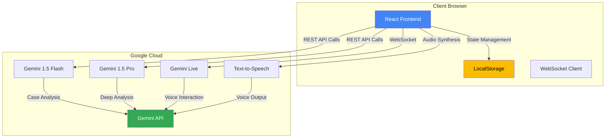

### Component Architecture

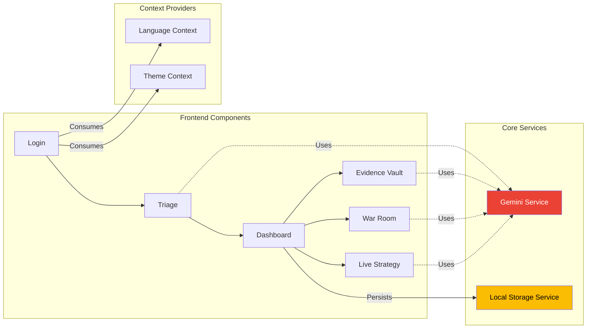

### Data Flow - Case Triage

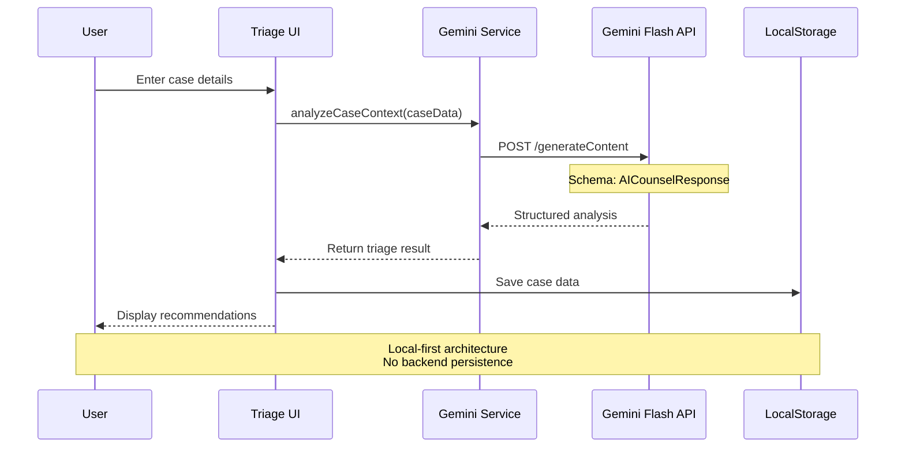

---

## Technology Stack

### Frontend Stack

```mermaid
graph TD
    subgraph "Build Tools"
        VITE[Vite 6.2]
        TS[TypeScript 5.8]
    end
    
    subgraph "UI Framework"
        REACT[React 19.2]
        DOM[React DOM]
    end
    
    subgraph "Styling"
        CSS[Vanilla CSS]
        CUSTOM[Custom Design System]
    end
    
    subgraph "AI Integration"
        GENAI[@google/genai SDK]
        MODELS[Flash/Pro/Live]
    end
    
    subgraph "Data Visualization"
        CHARTS[Recharts 3.5]
    end
    
    VITE --> REACT
    TS --> REACT
    REACT --> GENAI
    REACT --> CHARTS
    REACT --> CSS
    
    style REACT fill:#61dafb,color:#000
    style VITE fill:#646cff,color:#fff
    style GENAI fill:#4285f4,color:#fff
```

### AI Model Selection Strategy

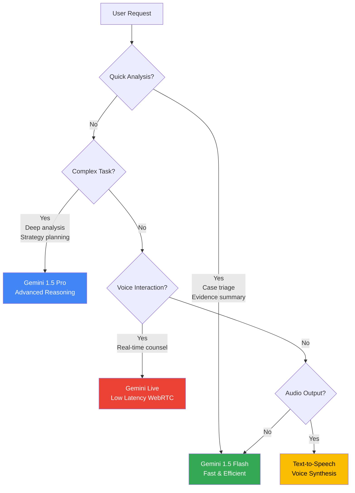

---

## Data Flow

### Evidence Analysis Pipeline

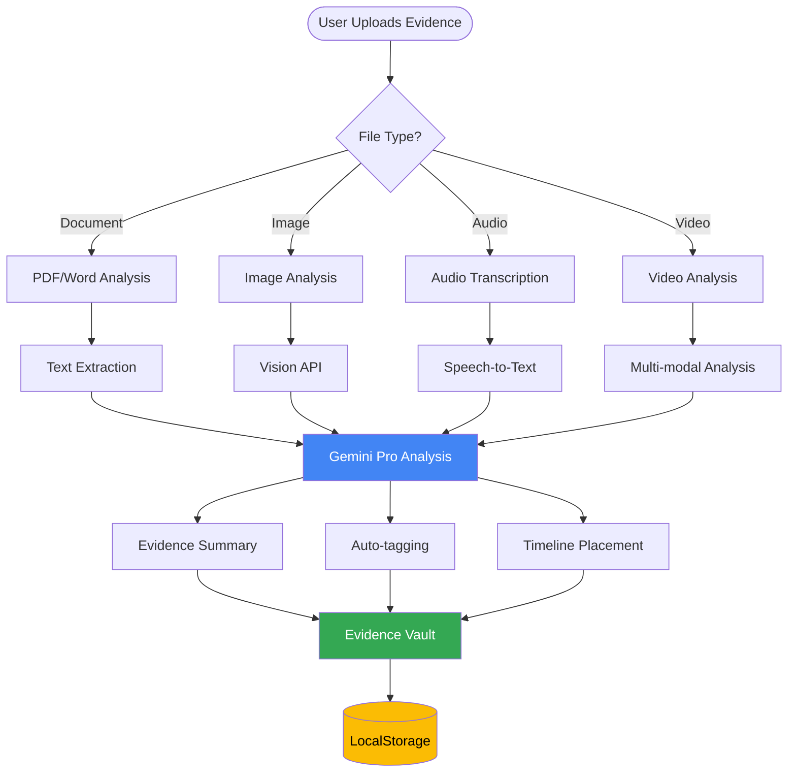

### Live Strategy Session Flow

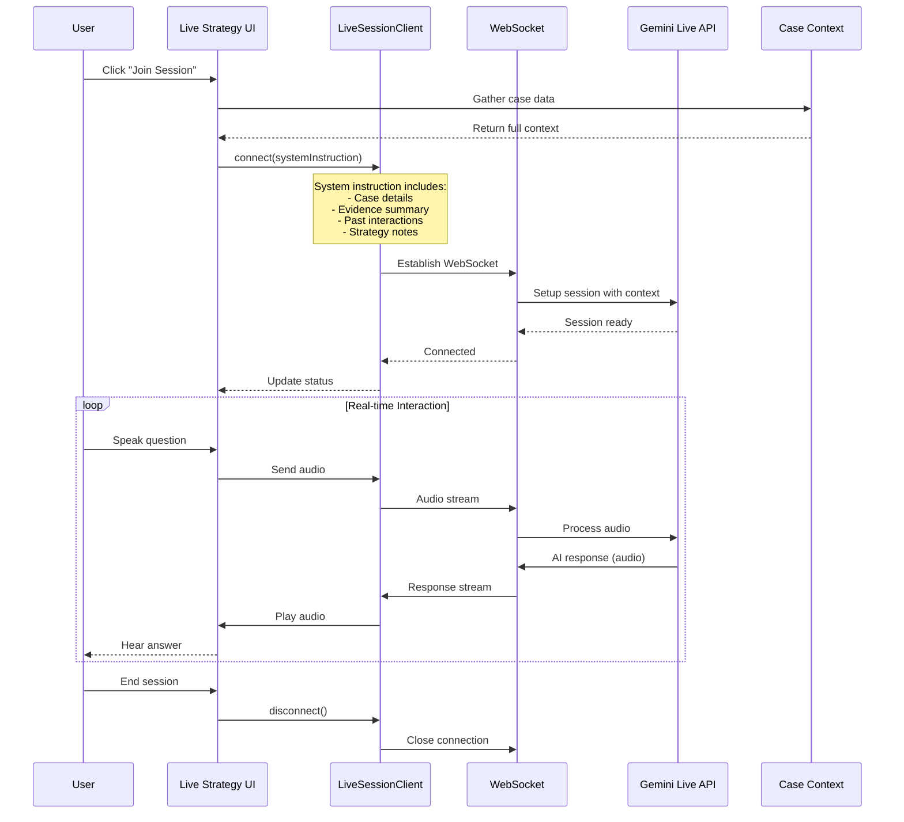

---

## Production Architecture

### Recommended Enterprise Architecture

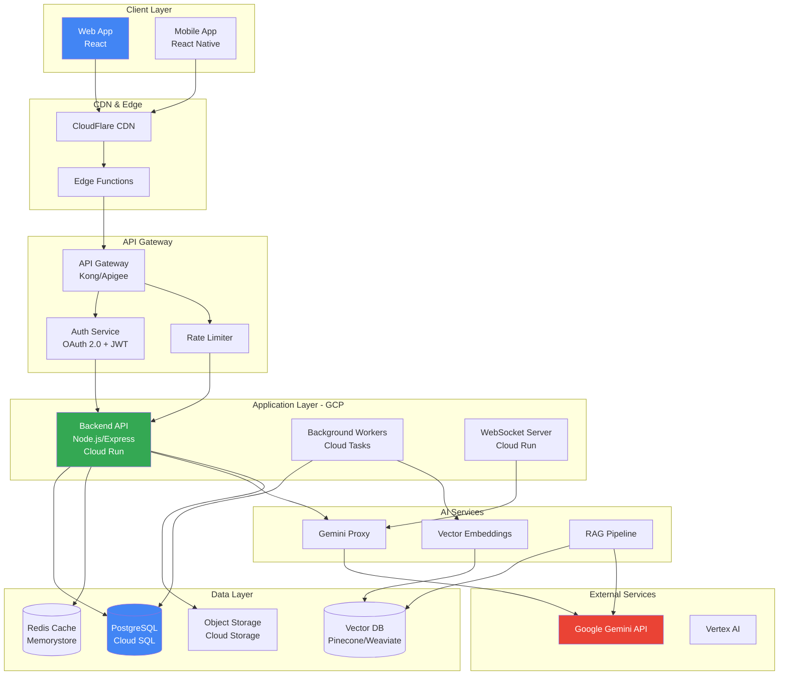

### Multi-Tenant Architecture

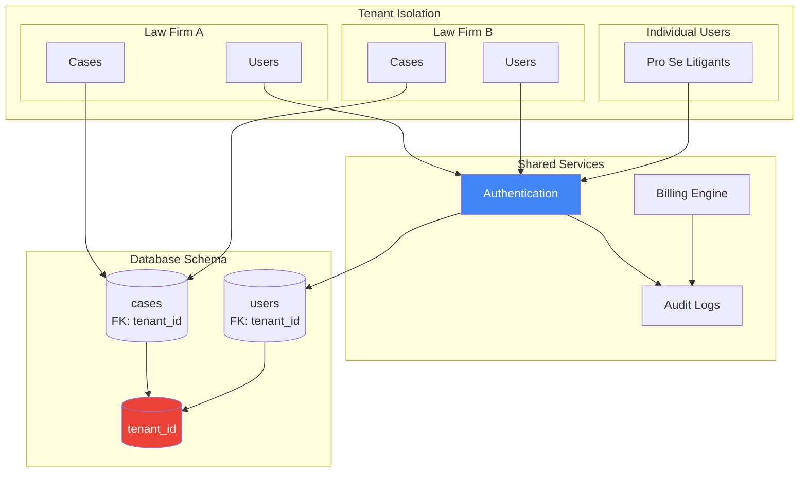

### Deployment Pipeline

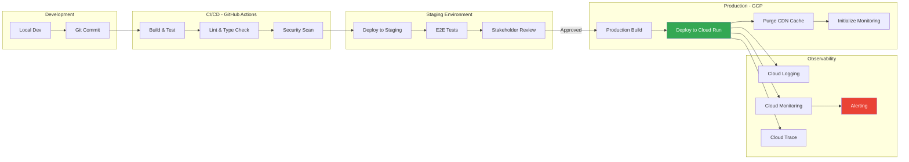

---

## Security Considerations

### Security Architecture

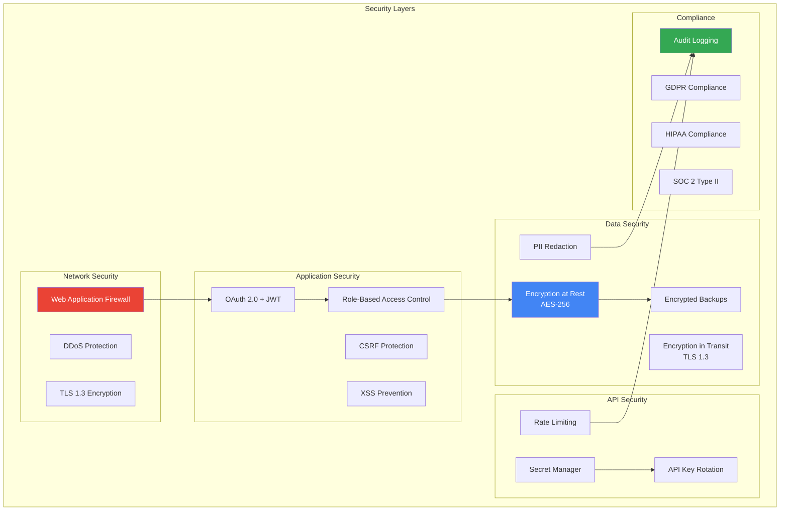

### Data Privacy Flow

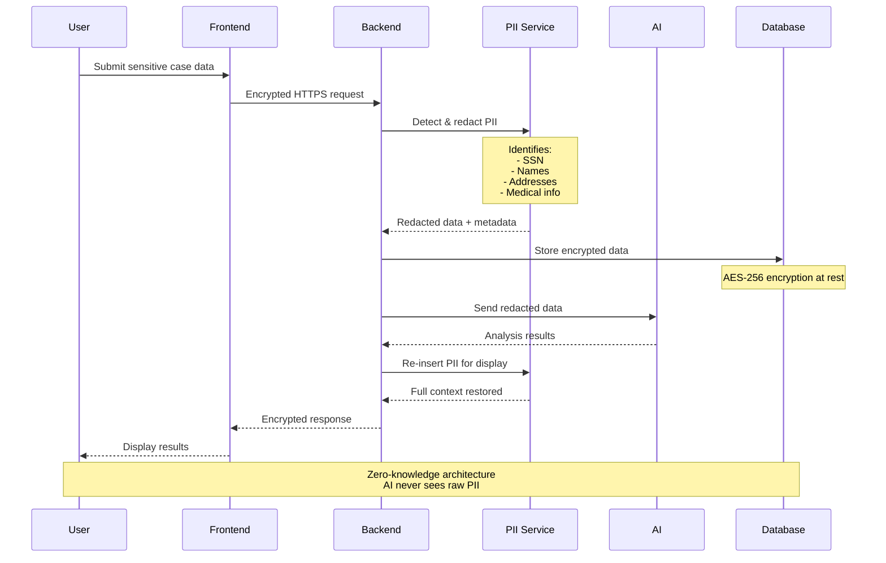

---

## Deployment Strategy

### Geographic Distribution

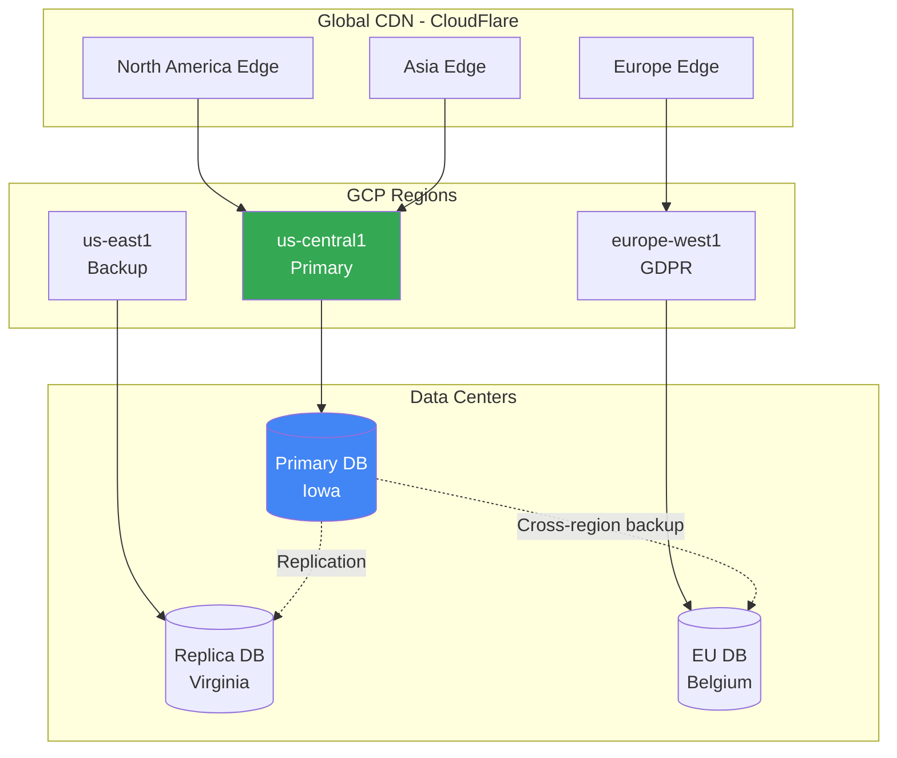

### Scaling Strategy

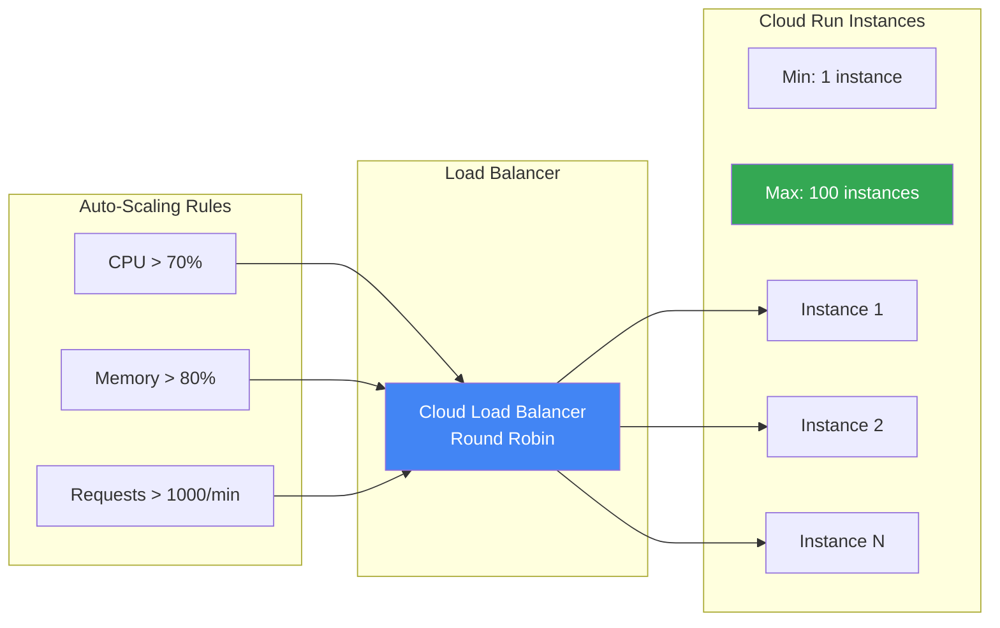

---

## Performance Metrics

### Target SLAs

| Metric | Target | Current MVP |
|--------|--------|-------------|
| **Page Load Time** | < 2s | ~1.5s |
| **API Response Time** | < 500ms | ~300ms (direct) |
| **AI Analysis** | < 5s | 3-8s |
| **Live Session Latency** | < 200ms | ~150ms |
| **Uptime** | 99.9% | N/A (local) |

### Monitoring Dashboard

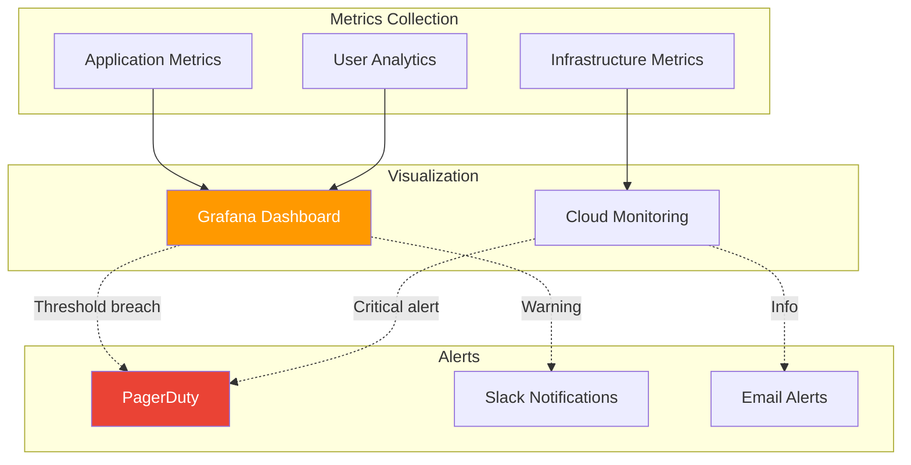

---

## Migration Path: MVP to Production

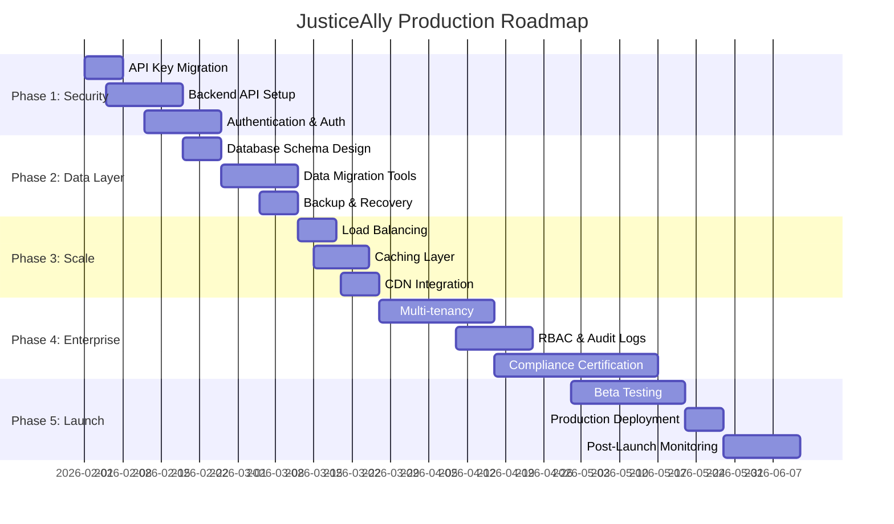

---

## Technology Decisions

### Why These Choices?

| Technology | Rationale |
|------------|-----------|
| **React 19** | Latest features, concurrent rendering, improved performance |
| **TypeScript** | Type safety critical for legal applications, better DX |
| **Vite** | Fastest build tool, instant HMR, optimized for modern browsers |
| **Google Gemini** | Best-in-class multimodal AI, native JSON output, cost-effective |
| **LocalStorage (MVP)** | Rapid prototyping, zero infrastructure, privacy-first |
| **Cloud Run (Prod)** | Serverless, auto-scaling, pay-per-use, easy deployment |
| **PostgreSQL (Prod)** | ACID compliance, proven for legal tech, excellent JSON support |

---

## Architecture Evolution

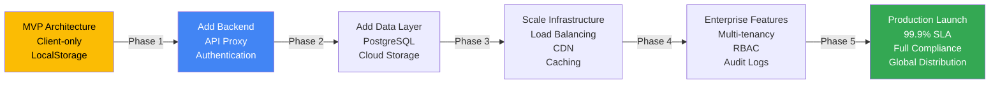

---

## Conclusion

JusticeAlly's architecture is designed for rapid iteration in the MVP phase while maintaining a clear path to enterprise-grade production deployment. The modular design allows for incremental improvements without requiring complete rewrites, ensuring continuous delivery of value to users while building toward a scalable, secure, and compliant legal tech platform.
