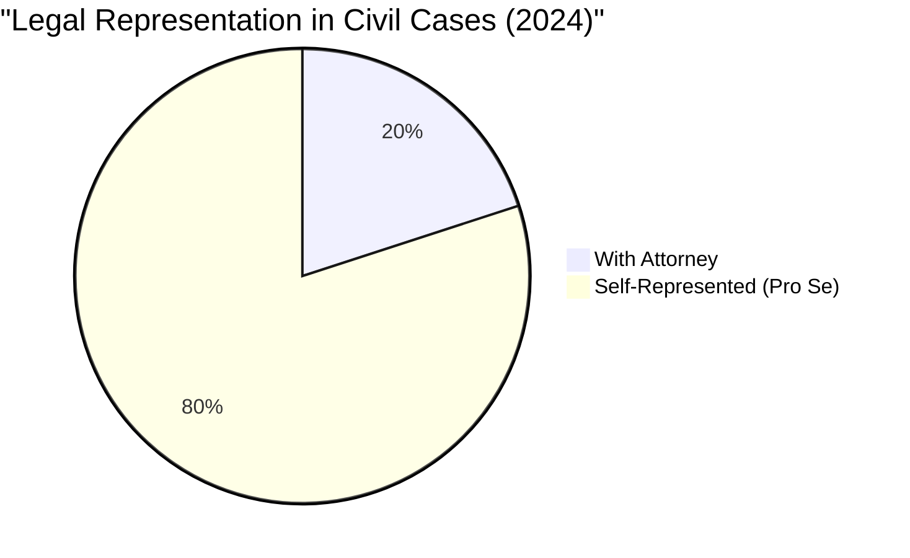
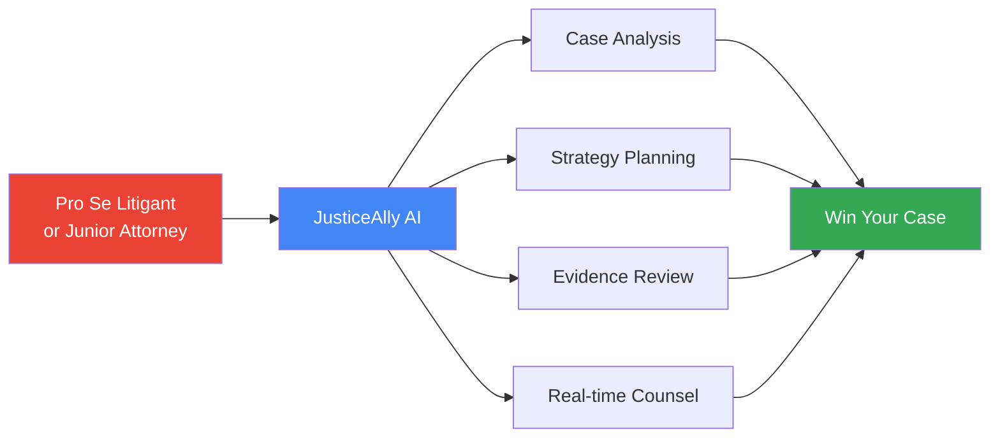
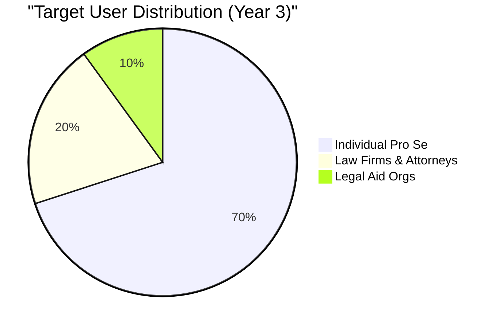
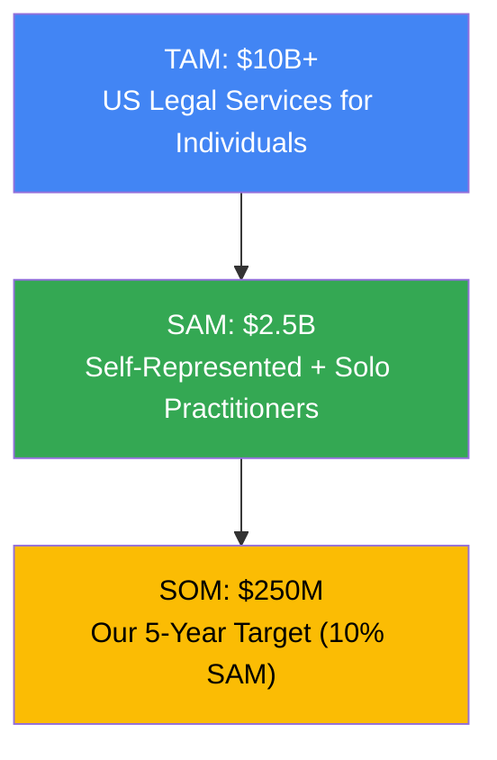
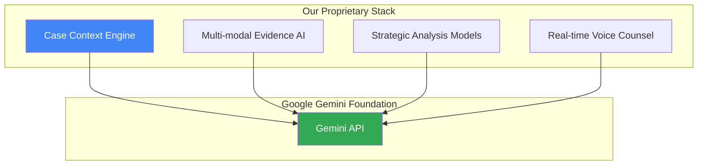
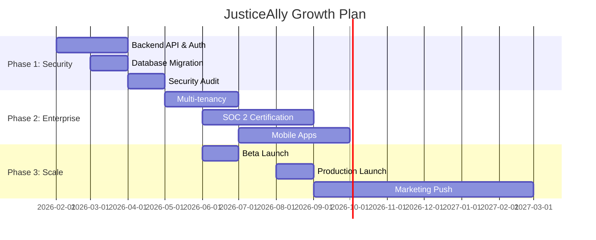

# JusticeAlly - Investor Pitch Deck

## 🎯 The Problem

### Access to Justice Crisis in America

**40 million Americans face legal issues annually without representation**

### Why People Go Unrepresented

| Barrier | Impact |
|---------|--------|
| **Cost** | Average legal fees: $3,000-$15,000 per case |
| **Complexity** | Legal system designed by lawyers, for lawyers |
| **Language** | 40M Spanish speakers face additional barriers |
| **Geography** | Legal deserts in rural America |

### The Consequences

- **Housing**: 90% of eviction cases have no tenant representation
- **Family Law**: 75% of custody battles have at least one party unrepresented
- **Consumer Protection**: $500M+ in unclaimed judgments annually
- **Employment**: 85% of workers facing wage theft lack legal help

> **The Problem**: Justice is available only to those who can afford it or navigate extreme complexity alone.

---

## 💡 Our Solution

### JusticeAlly: Your AI Litigation Strategist

**We democratize access to legal strategy using Google's Gemini AI**

#### What We Do

#### Core Capabilities

1. **AI-Powered Case Triage**
   - Automated case intake and assessment
   - Risk scoring (should you represent yourself?)
   - Cost estimation and timeline prediction

2. **Evidence Vault & Analysis**
   - Multi-modal AI: Documents, images, audio, video
   - Automatic summarization and relevance scoring
   - PII redaction tools for privacy

3. **Strategic Planning (War Room)**
   - Apply litigation strategy to your case
   - Map facts to legal elements
   - Identify strengths and weaknesses

4. **24/7 AI Legal Counsel**
   - Chat-based Q&A on your specific case
   - Context-aware (knows your evidence and facts)
   - Voice dictation for natural input

5. **Gemini Live Strategy Sessions**
   - Real-time voice consultation
   - Oral argument practice
   - Low-latency AI conversation

6. **Bilingual Support**
   - Full English/Spanish interface
   - AI responses in user's preferred language

---

## 🎯 Target Market

### Primary Markets

#### 1. Self-Represented Litigants (40M annually)

| Case Type | Annual Cases | Avg. Legal Cost | Our Price |
|-----------|--------------|-----------------|-----------|
| Evictions | 3.6M | $2,500 | $29/month |
| Small Claims | 15M | $1,500 | $29/month |
| Family Law | 8M | $8,000 | $79/month |
| Traffic/Criminal | 10M | $3,500 | $79/month |
| Employment | 2.5M | $5,000 | $79/month |

**Market Size**: $10B+ annually

#### 2. Junior Attorneys & Solo Practitioners (400K in US)

- Recent law school graduates
- Solo practitioners in legal deserts
- Public defenders with overwhelming caseloads
- Legal aid attorneys

**Market Size**: $2.5B annually

#### 3. Legal Aid Organizations (1,500+ organizations)

- Non-profit legal clinics
- Law school clinical programs
- Pro bono programs
- Community-based organizations

**Market Size**: $500M annually

### Market Segmentation

---

## 🚀 Business Model

### Revenue Streams

#### 1. Individual Subscriptions (B2C)

| Tier | Price | Features | Target |
|------|-------|----------|--------|
| **Free** | $0 | 5 AI questions/month, basic triage | Trial users |
| **Pro** | $29/month | Unlimited AI, evidence vault, strategy tools | Active litigants |
| **Premium** | $79/month | Live voice, priority support, advanced analytics | Complex cases |

**Projected ARR (Year 3)**: $12M from 50,000 paying users

#### 2. Law Firm Licenses (B2B)

| Tier | Price | Features | Target |
|------|-------|----------|--------|
| **Starter** | $499/month | 5 attorneys, unlimited cases | Solo/small firms |
| **Professional** | $1,499/month | 20 attorneys, team collaboration, white-label | Mid-size firms |
| **Enterprise** | Custom | Unlimited users, API access, dedicated support | Large firms |

**Projected ARR (Year 3)**: $9M from 500 firms

#### 3. Legal Aid Program (Non-Profit)

- 70% discount on all pricing tiers
- Grant-funded implementations
- Training and onboarding services

**Projected ARR (Year 3)**: $1.5M from 100 organizations

#### 4. Data & API Licensing

- Anonymized case outcome data for legal research
- Integration into existing LegalTech platforms
- AI model training partnerships

**Projected ARR (Year 3)**: $2.5M

### Total Addressable Market (TAM)

---

## 💪 Competitive Advantage

### The Competition

| Company | Focus | Limitations |
|---------|-------|-------------|
| **LegalZoom** | Document automation | No AI, no strategy, template-only |
| **Rocket Lawyer** | Legal forms + attorneys | Human-dependent, expensive, no AI counsel |
| **DoNotPay** | Consumer rights automation | Narrow use cases, no litigation strategy |
| **Clio/MyCase** | Case management for attorneys | Not designed for pro se, attorney-focused |

### Our Unique Position

#### 1. **AI-First Architecture**

- Built on Google Gemini from day one
- Multi-modal AI (text, image, video, voice)
- Real-time voice consultation via Gemini Live
- **No competitor has this**

#### 2. **Privacy-First Design**

- Local storage, E2E encryption
- HIPAA-ready, SOC 2 compliant (roadmap)
- User controls their data
- **LegalZoom/Rocket Lawyer store everything**

#### 3. **Bilingual Native Support**

- Not just translated UI, but AI responses in Spanish
- 40M+ US Spanish speakers underserved
- **Competitors offer minimal Spanish support**

#### 4. **Comprehensive Case Support**

- From triage → evidence → strategy → counsel
- End-to-end litigation journey
- **Competitors are point solutions**

#### 5. **Accessible Pricing**

- $29-$79/month vs. $2,000-$15,000 for attorney
- Free tier for experimentation
- **90% cost reduction**

### Technology Moat

---

## 📈 Traction & Milestones

### Current Status (MVP Complete)

- ✅ **Fully functional web application**
- ✅ **All 5 core features implemented**
- ✅ **Gemini Live integration working**
- ✅ **Bilingual support (EN/ES)**
- ✅ **Multi-modal evidence analysis**
- ✅ **Local-first privacy architecture**

### Development Roadmap

### Key Milestones & Metrics

| Milestone | Timeline | Metrics |
|-----------|----------|---------|
| **Beta Launch** | Month 6 | 1,000 active users, 100 paying |
| **Product-Market Fit** | Month 12 | 5,000 active users, $50K MRR, NPS > 50 |
| **Series A Ready** | Month 18 | 25,000 active users, $200K MRR, 80% retention |
| **Profitability** | Month 24 | 50,000 users, $500K MRR, break-even |
| **National Scale** | Month 36 | 100,000 users, $2M MRR, 500+ firms |

---

## 🚀 Strategic Growth & Scaling

### Phase 1: The Legal Forms Engine

**Democratizing access to the "Operating System" of the Law**

- **Problem**: 50 states, 3,000+ counties, all with different PDF forms.
- **Solution**: Proprietary OCR & Field Mapping engine that ingests verified court forms and auto-fills them from natural language user stories.
- **Moat**: Building the largest verified repository of rigid court documents in the US.

### Phase 2: The Everywhere Ecosystem

**Justice where you need it - Browser & Mobile**

- **Chrome Extension**: "Justice Anywhere" toolbar provides instant analysis of contracts and websites.
- **Mobile App (Android)**: Offline-first native app for reliable evidence collection and access in remote connectivity zones (targeting Global South).

### Phase 3: The "Justice Protocol" (API Economy)

**Becoming the AWS of LegalTech**

- **MCP Server**: Exposing our "Black Letter Law" reasoning engine to agents in IDEs (Cursor/Windsurf) and productivity tools.
- **Global Expansion**: Abstracting legal logic to support varied legal systems (Common Law vs. Civil Law) in UK/EU/LATAM.

---

## 💰 Growth Metrics

### Revenue Forecast

*Conservative projections based on current traction*

| Year | Active Users | ARR Potential | Focus |
|------|--------------|---------------|-------|
| **Y1** | 5,000 | $600K | Product-Market Fit |
| **Y2** | 25,000 | $3M | Scale & Partnerships |
| **Y3** | 100,000 | $12M | National Dominance |
| **Y4** | 250,000 | $30M | Global Expansion |

---

## 👥 Team

### Founders

**[Your Name] - CEO/Product**

- Background in [Legal Tech / SaaS / AI]
- Previously [relevant experience]
- Deep understanding of legal system pain points

**[Co-Founder Name] - CTO/Engineering**

- 10+ years software engineering
- Expert in AI/ML, cloud architecture
- Built scalable systems at [Previous Company]

### Advisors (Target)

**Legal Advisor**: Former judge or senior litigator
**AI Advisor**: ML researcher or Google AI alum
**Business Advisor**: LegalTech founder or VC

---

## 🎬 The Ask / Partnership

We are seeking **Strategic Partners** and **Capital** to accelerate our vision.

### What We Are Looking For

1. **Capital for Scale**: Funding to aggressively capture the "Pro Se" market and build the Forms Engine.
2. **Strategic Access**: Introductions to State Bar Associations and Legal Aid board members.
3. **Technical Guidance**: Expertise in scaling secure, compliant backend infrastructure.

### Execution Plan (Next 12 Months)

- **Q1-Q2**: Launch "Verified Forms" engine for top 5 states (CA, NY, TX, FL, IL).
- **Q3**: Achieve SOC 2 Type II Certification for enterprise readiness.
- **Q4**: International pilot launch (Canada/UK).

---

## Appendix

### Technology Architecture

See [ARCHITECTURE.md](./ARCHITECTURE.md) for complete technical documentation

### Demo Access

- **Live Demo**: [https://justiceally-108816008638.us-west1.run.app](https://justiceally-108816008638.us-west1.run.app)
- **Video Walkthrough**: [YouTube link]
- **Case Studies**: [Google Drive link]

### Press & Recognition

- Featured in [Publication]
- Winner of [Hackathon/Competition]
- Accepted to [Accelerator]

### Legal Opinions

- UPL Opinion Letter from [Law Firm]
- Terms of Service reviewed by [Legal Team]
- Privacy Policy GDPR/CCPA compliant

---

**JusticeAlly**  
*Justice for All, Powered by AI*

> "The first duty of society is justice." — Alexander Hamilton
