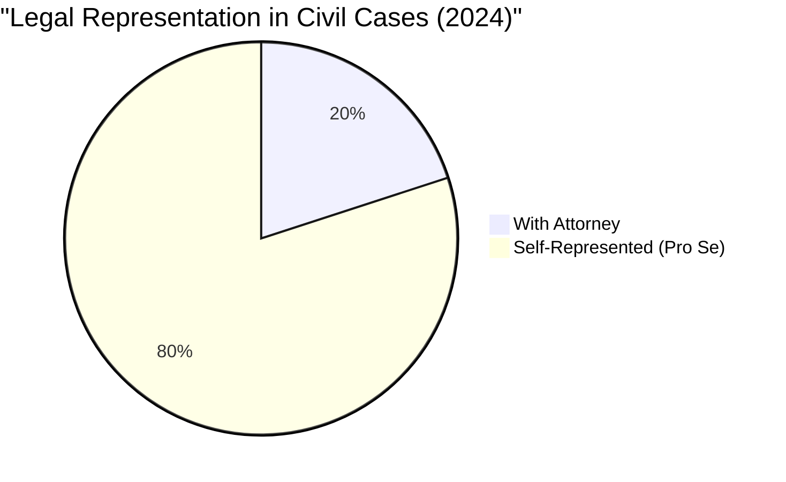
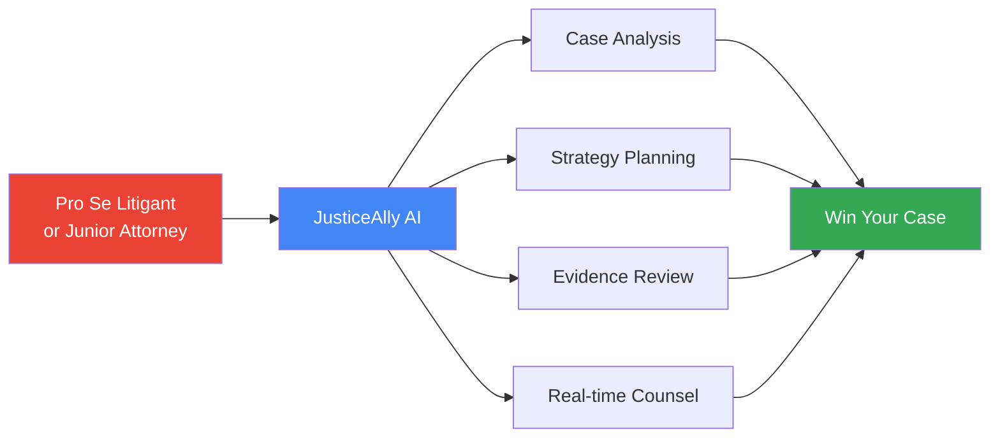
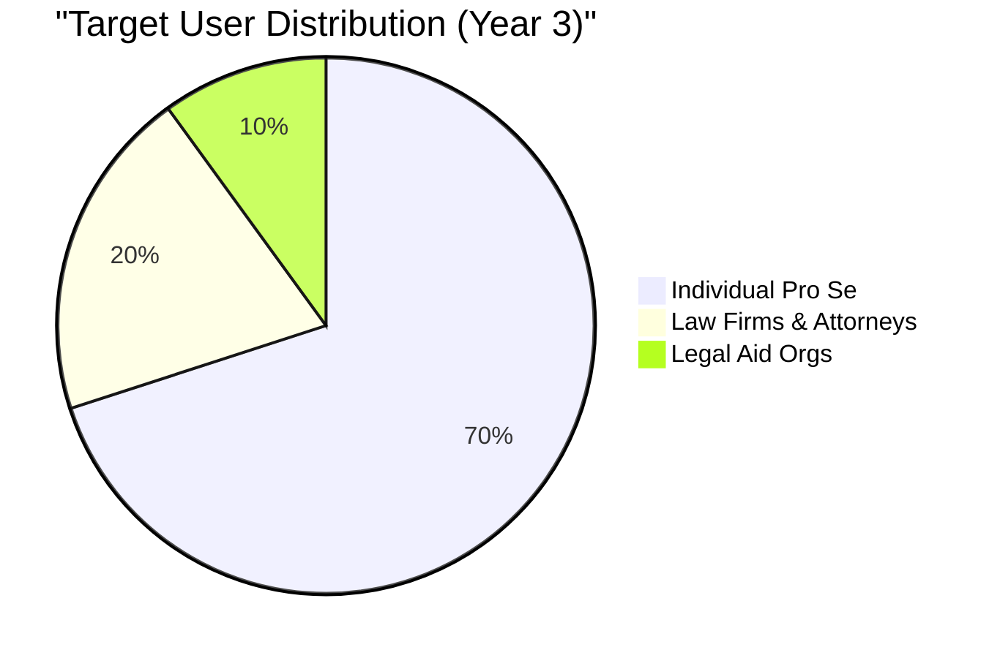
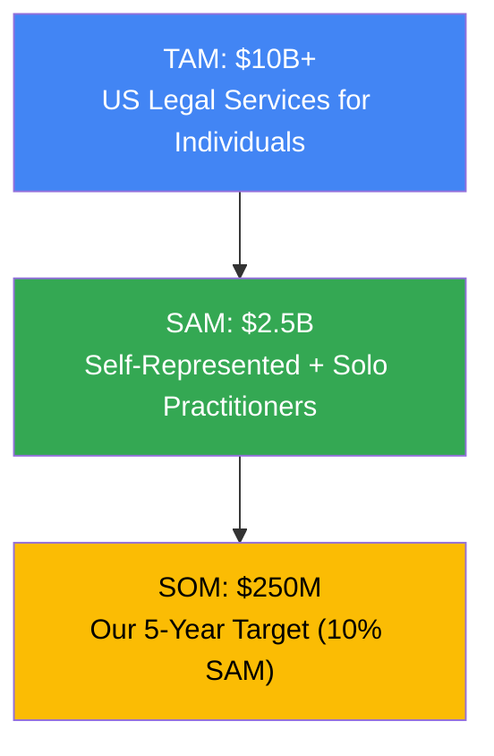
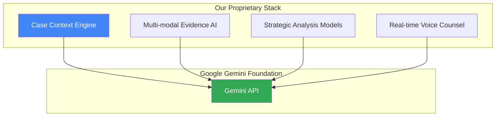
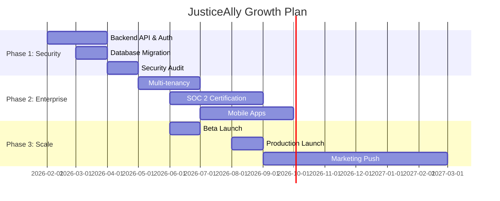
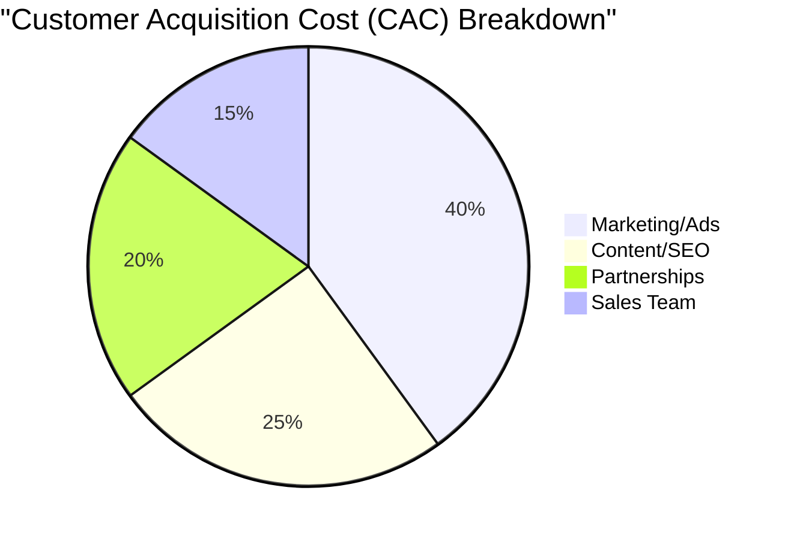

# JusticeAlly - Investor Pitch Deck

## 🎯 The Problem

### Access to Justice Crisis in America

**40 million Americans face legal issues annually without representation**

### Why People Go Unrepresented

| Barrier | Impact |
|---------|--------|
| **Cost** | Average legal fees: $3,000-$15,000 per case |
| **Complexity** | Legal system designed by lawyers, for lawyers |
| **Language** | 40M Spanish speakers face additional barriers |
| **Geography** | Legal deserts in rural America |

### The Consequences

- **Housing**: 90% of eviction cases have no tenant representation
- **Family Law**: 75% of custody battles have at least one party unrepresented
- **Consumer Protection**: $500M+ in unclaimed judgments annually
- **Employment**: 85% of workers facing wage theft lack legal help

> **The Problem**: Justice is available only to those who can afford it or navigate extreme complexity alone.

---

## 💡 Our Solution

### JusticeAlly: Your AI Litigation Strategist

**We democratize access to legal strategy using Google's Gemini AI**

#### What We Do

#### Core Capabilities

1. **AI-Powered Case Triage**
   - Automated case intake and assessment
   - Risk scoring (should you represent yourself?)
   - Cost estimation and timeline prediction

2. **Evidence Vault & Analysis**
   - Multi-modal AI: Documents, images, audio, video
   - Automatic summarization and relevance scoring
   - PII redaction tools for privacy

3. **Strategic Planning (War Room)**
   - Apply litigation strategy to your case
   - Map facts to legal elements
   - Identify strengths and weaknesses

4. **24/7 AI Legal Counsel**
   - Chat-based Q&A on your specific case
   - Context-aware (knows your evidence and facts)
   - Voice dictation for natural input

5. **Gemini Live Strategy Sessions**
   - Real-time voice consultation
   - Oral argument practice
   - Low-latency AI conversation

6. **Bilingual Support**
   - Full English/Spanish interface
   - AI responses in user's preferred language

---

## 🎯 Target Market

### Primary Markets

#### 1. Self-Represented Litigants (40M annually)

| Case Type | Annual Cases | Avg. Legal Cost | Our Price |
|-----------|--------------|-----------------|-----------|
| Evictions | 3.6M | $2,500 | $29/month |
| Small Claims | 15M | $1,500 | $29/month |
| Family Law | 8M | $8,000 | $79/month |
| Traffic/Criminal | 10M | $3,500 | $79/month |
| Employment | 2.5M | $5,000 | $79/month |

**Market Size**: $10B+ annually

#### 2. Junior Attorneys & Solo Practitioners (400K in US)

- Recent law school graduates
- Solo practitioners in legal deserts
- Public defenders with overwhelming caseloads
- Legal aid attorneys

**Market Size**: $2.5B annually

#### 3. Legal Aid Organizations (1,500+ organizations)

- Non-profit legal clinics
- Law school clinical programs
- Pro bono programs
- Community-based organizations

**Market Size**: $500M annually

### Market Segmentation

---

## 🚀 Business Model

### Revenue Streams

#### 1. Individual Subscriptions (B2C)

| Tier | Price | Features | Target |
|------|-------|----------|--------|
| **Free** | $0 | 5 AI questions/month, basic triage | Trial users |
| **Pro** | $29/month | Unlimited AI, evidence vault, strategy tools | Active litigants |
| **Premium** | $79/month | Live voice, priority support, advanced analytics | Complex cases |

**Projected ARR (Year 3)**: $12M from 50,000 paying users

#### 2. Law Firm Licenses (B2B)

| Tier | Price | Features | Target |
|------|-------|----------|--------|
| **Starter** | $499/month | 5 attorneys, unlimited cases | Solo/small firms |
| **Professional** | $1,499/month | 20 attorneys, team collaboration, white-label | Mid-size firms |
| **Enterprise** | Custom | Unlimited users, API access, dedicated support | Large firms |

**Projected ARR (Year 3)**: $9M from 500 firms

#### 3. Legal Aid Program (Non-Profit)

- 70% discount on all pricing tiers
- Grant-funded implementations
- Training and onboarding services

**Projected ARR (Year 3)**: $1.5M from 100 organizations

#### 4. Data & API Licensing

- Anonymized case outcome data for legal research
- Integration into existing LegalTech platforms
- AI model training partnerships

**Projected ARR (Year 3)**: $2.5M

### Total Addressable Market (TAM)

---

## 💪 Competitive Advantage

### The Competition

| Company | Focus | Limitations |
|---------|-------|-------------|
| **LegalZoom** | Document automation | No AI, no strategy, template-only |
| **Rocket Lawyer** | Legal forms + attorneys | Human-dependent, expensive, no AI counsel |
| **DoNotPay** | Consumer rights automation | Narrow use cases, no litigation strategy |
| **Clio/MyCase** | Case management for attorneys | Not designed for pro se, attorney-focused |

### Our Unique Position

#### 1. **AI-First Architecture**

- Built on Google Gemini from day one
- Multi-modal AI (text, image, video, voice)
- Real-time voice consultation via Gemini Live
- **No competitor has this**

#### 2. **Privacy-First Design**

- Local storage, E2E encryption
- HIPAA-ready, SOC 2 compliant (roadmap)
- User controls their data
- **LegalZoom/Rocket Lawyer store everything**

#### 3. **Bilingual Native Support**

- Not just translated UI, but AI responses in Spanish
- 40M+ US Spanish speakers underserved
- **Competitors offer minimal Spanish support**

#### 4. **Comprehensive Case Support**

- From triage → evidence → strategy → counsel
- End-to-end litigation journey
- **Competitors are point solutions**

#### 5. **Accessible Pricing**

- $29-$79/month vs. $2,000-$15,000 for attorney
- Free tier for experimentation
- **90% cost reduction**

### Technology Moat

---

## 📈 Traction & Milestones

### Current Status (MVP Complete)

- ✅ **Fully functional web application**
- ✅ **All 5 core features implemented**
- ✅ **Gemini Live integration working**
- ✅ **Bilingual support (EN/ES)**
- ✅ **Multi-modal evidence analysis**
- ✅ **Local-first privacy architecture**

### Development Roadmap

### Key Milestones & Metrics

| Milestone | Timeline | Metrics |
|-----------|----------|---------|
| **Beta Launch** | Month 6 | 1,000 active users, 100 paying |
| **Product-Market Fit** | Month 12 | 5,000 active users, $50K MRR, NPS > 50 |
| **Series A Ready** | Month 18 | 25,000 active users, $200K MRR, 80% retention |
| **Profitability** | Month 24 | 50,000 users, $500K MRR, break-even |
| **National Scale** | Month 36 | 100,000 users, $2M MRR, 500+ firms |

---

## 💰 Financial Projections

### Revenue Forecast (5 Years)

| Year | Users | MRR | ARR | Growth Rate |
|------|-------|-----|-----|-------------|
| **Y1** | 5,000 | $50K | $600K | - |
| **Y2** | 25,000 | $250K | $3M | 400% |
| **Y3** | 100,000 | $1M | $12M | 300% |
| **Y4** | 250,000 | $2.5M | $30M | 150% |
| **Y5** | 500,000 | $5M | $60M | 100% |

### Unit Economics

**Target Metrics:**

- **CAC (Customer Acquisition Cost)**: $50-$100
- **LTV (Lifetime Value)**: $800-$1,200
- **LTV:CAC Ratio**: 8:1 to 12:1
- **Payback Period**: 2-3 months
- **Gross Margin**: 85%+ (software)

### Use of Seed Funding ($1.5M)

| Category | Amount | % | Purpose |
|----------|--------|---|---------|
| **Engineering & Product** | $750K | 50% | Backend, mobile, AI features |
| **Sales & Marketing** | $375K | 25% | Customer acquisition, partnerships |
| **Legal & Compliance** | $225K | 15% | SOC 2, legal review, insurance |
| **Operations & Infrastructure** | $150K | 10% | Cloud costs, tools, admin |

**Burn Rate**: $125K/month (12-month runway)

---

## 👥 Team

### Founders

**[Your Name] - CEO/Product**

- Background in [Legal Tech / SaaS / AI]
- Previously [relevant experience]
- Deep understanding of legal system pain points

**[Co-Founder Name] - CTO/Engineering**

- 10+ years software engineering
- Expert in AI/ML, cloud architecture
- Built scalable systems at [Previous Company]

### Advisors (Target)

**Legal Advisor**: Former judge or senior litigator
**AI Advisor**: ML researcher or Google AI alum
**Business Advisor**: LegalTech founder or VC

### Hiring Plan (First 12 Months)

| Role | Months 1-3 | Months 4-6 | Months 7-12 |
|------|------------|------------|-------------|
| **Engineering** | Backend, DevOps | 2x AI Engineers | 2x Mobile Engineers |
| **Product** | - | Product Manager | UX Designer |
| **Legal/Compliance** | Compliance Specialist | Legal Content Creator | - |
| **GTM** | - | Customer Success | VP Sales, Marketing Manager |

---

## 🎯 Go-to-Market Strategy

### Phase 1: Product-Led Growth (Months 0-6)

**Strategy**: Free tier drives viral growth

1. **Content Marketing**
   - Blog: "How to Win in Small Claims Court"
   - YouTube: Legal strategy tutorials
   - SEO for "how to represent yourself"

2. **Community Building**
   - Reddit: r/legaladvice, r/personalfinance
   - Facebook groups for pro se litigants
   - Discord for legal aid workers

3. **Strategic Partnerships**
   - Legal aid societies (pilot programs)
   - Law school clinics (student training)
   - Local bar associations (CLE sponsorships)

**Target**: 5,000 free users, 500 paid conversions

### Phase 2: Direct Sales (Months 6-12)

**Strategy**: B2B sales to law firms and legal aid

1. **Outbound Sales**
   - Target solo practitioners and small firms
   - Focus on legal deserts (underserved areas)
   - Legal aid conference sponsorships

2. **Inbound Marketing**
   - Case study content
   - Webinars on AI for attorneys
   - Free firm trials (14 days)

3. **Channel Partnerships**
   - LegalTech platforms (integrations)
   - Bar association partnerships
   - Legal billing software partnerships

**Target**: 50 law firm accounts, 10 legal aid orgs

### Phase 3: Scale (Months 12-24)

**Strategy**: National marketing push

1. **Performance Marketing**
   - Google Ads: Legal keywords
   - Facebook/Instagram: Targeted demos
   - Podcast sponsorships (true crime, legal)

2. **PR & Media**
   - TechCrunch, VentureBeat coverage
   - Legal industry publications
   - Success story press releases

3. **Enterprise Sales**
   - Dedicated sales team
   - Large law firm outreach
   - Government/municipal pilots

**Target**: 25,000 users, $250K MRR

---

## 🛡️ Risk Analysis & Mitigation

### Key Risks

#### 1. **Unauthorized Practice of Law (UPL)**

**Risk**: Regulators could claim we're practicing law without a license

**Mitigation**:

- Clear disclaimers: "Educational tool, not legal advice"
- Legal advisory board review
- State-by-state bar association outreach
- E&O insurance ($5M coverage)
- User acknowledges limitations at signup

**Precedent**: LegalZoom, Rocket Lawyer operate successfully with similar disclaimers

#### 2. **AI Accuracy & Liability**

**Risk**: AI provides incorrect legal analysis, user loses case

**Mitigation**:

- Human-in-the-loop review for critical decisions
- Confidence scoring on all AI outputs
- "Second opinion" feature (another AI model)
- Comprehensive liability insurance
- Terms of Service limit liability
- Encourage attorney consultation for complex matters

#### 3. **Data Security & Privacy**

**Risk**: Sensitive legal data breach

**Mitigation**:

- SOC 2 Type II certification (Month 9)
- End-to-end encryption
- Zero-knowledge architecture
- Regular penetration testing
- Bug bounty program
- Cyber insurance ($10M coverage)

#### 4. **Google Gemini API Dependency**

**Risk**: API pricing changes or availability issues

**Mitigation**:

- Model-agnostic architecture (can swap to GPT-4, Claude)
- Caching layer to reduce API calls
- Direct Vertex AI integration (better pricing)
- Negotiate enterprise pricing with Google
- Build proprietary fine-tuned models over time

#### 5. **Competition from Big Tech**

**Risk**: Google, Microsoft launch competing products

**Mitigation**:

- First-mover advantage (12-18 month lead)
- Deep domain expertise in litigation strategy
- Community and partnerships moat
- Niche focus (vs. their broad products)
- Potential acquisition target

### Regulatory Landscape

**Favorable Trends**:

- ABA encourages innovative delivery of legal services
- Several states (Utah, Arizona) have regulatory sandboxes
- Access to justice initiatives by state courts
- Pro se assistance programs expanding nationwide

---

## 🚀 Investment Ask

### Seed Round: **$1.5 Million**

**Valuation**: $6M pre-money ($7.5M post-money)

**Structure**: 20% equity (SAFE or priced round)

### What You Get

#### Financial Returns

- **10x potential in 5 years** ($60M ARR at 3x revenue multiple = $180M valuation)
- Clear path to profitability by Month 24
- Series A exit opportunity at 18 months (8-10x)
- Acquisition potential by LegalZoom, Clio, or Google

#### Impact Returns

- **Enable 100,000+ people to access justice**
- Level the playing field for underserved communities
- Create 50+ high-quality jobs
- Transform the legal industry

### Use of Funds (12-Month Runway)

**Month breakdown:**

- Months 1-6: Build production infrastructure, early hires
- Months 7-9: Beta launch, SOC 2 certification
- Months 10-12: Marketing push, Series A prep

**Key Deliverables:**

- Month 6: Production launch (1,000 users)
- Month 9: SOC 2 certified
- Month 12: Product-market fit ($50K MRR)

---

## 📊 Success Metrics & Board Reporting

### North Star Metric

**Monthly Active Cases**: Cases actively being worked on with JusticeAlly

### KPIs We'll Track

| Category | Metrics |
|----------|---------|
| **Growth** | MAU, New signups, Conversion rate (free → paid) |
| **Revenue** | MRR, ARR, ARPU, LTV:CAC |
| **Engagement** | DAU/MAU ratio, Sessions per user, Time in app |
| **Product** | Feature adoption, NPS, Support tickets |
| **Outcomes** | Cases won (user reported), User satisfaction, Testimonials |

### Monthly Investor Updates

1. Key metrics dashboard
2. Revenue & cash position
3. Product milestones
4. Customer stories
5. Challenges & asks

---

## 🎬 The Ask

### What We Need From You

1. **Capital**: $1.5M to reach Product-Market Fit
2. **Network**: Introductions to legal industry partners
3. **Expertise**: Guidance on legal compliance and scaling
4. **Follow-on**: Commitment to Series A participation

### What Happens Next

**Week 1**: Product demo with your team  
**Week 2**: Technical & legal diligence  
**Week 3**: Reference calls with advisors  
**Week 4**: Term sheet & closing

### Contact

**Email**: [email]  
**Phone**: [phone]  
**Demo**: [calendly link]  
**Deck**: [deck link]

---

## 🌟 Vision

**By 2030, JusticeAlly will be the default AI legal strategist for millions of Americans**, ensuring that justice is determined by the merits of the case, not the size of the legal budget.

We're not just building a SaaS product. We're building the infrastructure for accessible justice in the AI age.

**Join us in making justice accessible to all.**

---

## Appendix

### Technology Architecture

See [ARCHITECTURE.md](./ARCHITECTURE.md) for complete technical documentation

### Demo Access

- **Live Demo**: <http://justiceally-demo.com>
- **Video Walkthrough**: [YouTube link]
- **Case Studies**: [Google Drive link]

### Press & Recognition

- Featured in [Publication]
- Winner of [Hackathon/Competition]
- Accepted to [Accelerator]

### Legal Opinions

- UPL Opinion Letter from [Law Firm]
- Terms of Service reviewed by [Legal Team]
- Privacy Policy GDPR/CCPA compliant

---

**JusticeAlly**  
*Justice for All, Powered by AI*

> "The first duty of society is justice." — Alexander Hamilton
