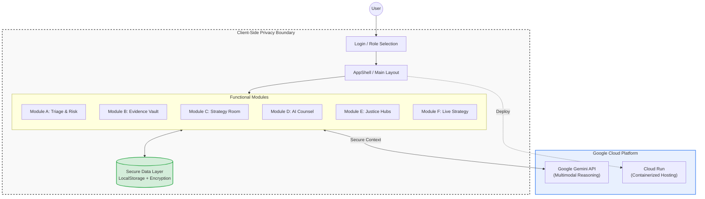

# JusticeAlly: The Universal Legal Navigator

<div align="center">


<br/>


</div>

**JusticeAlly** is an AI-powered legal navigation platform designed to bridge the "Access to Justice" gap. Acting as a **Senior Litigation Strategist** for Self-Represented Litigants and a **Force Multiplier** for Junior Attorneys, it combines ruthless legal strategy with compassionate administrative guidance powered by Google's Gemini AI.

> **🚀 Live Demo**: [https://justiceally-108816008638.us-west1.run.app](https://justiceally-108816008638.us-west1.run.app)
>
> **🎯 Current Status**: MVP demonstrating core AI capabilities | [View Full Architecture](./ARCHITECTURE.md) | [View Pitch Deck](./PITCH_DECK.md)

## 📋 Table of Contents

- [System Architecture](#system-architecture)
- [Project Structure](#project-structure)
- [Installation & Setup](#installation)
- [Capabilities](#capabilities)
- [Capabilities](#capabilities)
- [Tech Stack](#tech-stack)
- [Contributing](#contributing)

---

## <a id="system-architecture"></a>🏗️ System Architecture



## <a id="tech-stack"></a>🛠️ Technology Stack

| Component | Technologies |
|-----------|--------------|
| **Frontend** |    |
| **Styling** |  (Custom Design System) |
| **AI Engine** |  (Multimodal Reasoning) |
| **Infrastructure** |   |
| **Data Privacy** | LocalStorage (Client-Side Persistence), In-Memory State |

### <a id="project-structure"></a>📂 Project Structure

```bash
├── src/
│   ├── components/       # Reusable UI components (ChatInterface, StrategyBoard)
│   ├── services/         # API integrations (Gemini AI service)
│   ├── context/          # Global state management
│   ├── utils/            # Helper functions and types
│   └── App.tsx           # Main application entry
├── public/               # Static assets
├── Dockerfile            # Container definition
└── package.json          # Dependencies and scripts
```

---

## <a id="installation"></a>💻 Installation & Setup

For a quick preview, visit the **[Live Demo](https://justiceally-108816008638.us-west1.run.app)**.

To run the project locally for development:

### Prerequisites

- **Node.js** (v18 or higher)
- **Google Gemini API Key** (Get one at [Google AI Studio](https://aistudio.google.com/))

### 1. Clone the Repository

```bash
git clone https://github.com/your-username/justice-ally.git
cd justice-ally
```

### 2. Install Dependencies

```bash
npm install
# or
yarn install
```

### 3. Environment Configuration

Create a `.env` file in the root directory. You **must** add your Gemini API key here. This file is git-ignored to protect your secrets.

```env
# .env
API_KEY=your_google_gemini_api_key_here
```

### 4. Run the Application

Start the development server.

```bash
npm run dev
```

Open [http://localhost:5173](http://localhost:5173) (or the port shown in your terminal) to view the app.

---

## 🚀 Deployment

### Vercel / Netlify

1. Fork this repository to your GitHub.
2. Import the project into Vercel or Netlify.
3. **Critical:** Add `API_KEY` to the **Environment Variables** in the deployment settings.
4. Deploy!

**Note:** Since this is a Vite app, the build command is `npm run build` and the output directory is `dist`.

---

## 🔧 Troubleshooting & Git Operations

### Unable to Push to GitHub?

If you encounter errors when pushing, check the following:

1. **Large Files**: Ensure you haven't accidentally committed large video or image files from your testing. The `.gitignore` is set up to exclude standard artifacts, but check your manual adds.
2. **Secrets in History**: If you accidentally committed your `.env` file, remove it immediately:

    ```bash
    git rm --cached .env
    echo ".env" >> .gitignore
    git commit -m "Remove secrets"
    ```

### API Errors (403/503)

- **403 Permission Denied**: Verify your API Key in `.env` is correct and has access to **Gemini 1.5 Pro/Flash** and **Gemini 3.0 Pro** models.
- **503 Unavailable**: The model might be overloaded. The app includes an exponential backoff retry mechanism, but you can also try again in a few seconds.

---

## <a id="capabilities"></a>🌟 Application Capabilities

JusticeAlly provides a comprehensive suite of tools designed to empower users at every stage of the legal process.

### 🧠 Core Intelligence

- **Case Triage & Risk Matrix**: Intelligent intake system that evaluates case viability using a Red/Yellow/Green risk assessment model. It analyzes jurisdiction, claims, and available evidence to recommend whether a user should proceed Pro Se or seek counsel.
- **Bilingual Legal Brain**: The entire application toggles instantly between English and Spanish ("Justicia Aliada"), ensuring equal access to justice. The AI understands legal nuance in both languages.

### 🛡️ Evidence Management (Secure Vault)

- **Multi-Modal Ingestion**: Upload case files including PDFs, High-Res Images, and **Body Cam/CCTV Footage (MP4)**.
- **Smart Redaction Studio**: Integrated tool to manually or automatically redact Personally Identifiable Information (PII) before submission.
- **Evidence Relevance Engine**: AI-powered scoring system (1-10) that evaluates how strongly each piece of evidence supports individual legal elements (Duty, Breach, Causation, Damages).

### ⚔️ Litigation Strategy (The War Room)

- **Strategic Roadmap**: Generates a phase-by-phase litigation plan (Pre-filing -> Discovery -> Motion Practice -> Trial).
- **Black Letter Law Analysis**: Automatically maps user facts to specific legal elements required by state law.
- **"Sun Tzu" Competitive Analysis**: Predicts opposing counsel's likely moves and suggests counter-strategies.
- **Voice-to-Memo**: Dictate strategy notes directly into a structured legal memorandum format.

### 🤖 AI Counsel (Interactive Assistant)

- **Wargame Simulation**: Roleplay scenarios with the AI acting as an aggressive Opposing Counsel or a skeptical Judge to prepare for court.
- **Socratic Legal Guide**: Ask complex questions ("What is the statute of limitations for fraud in CA?") and receive cited, simplified answers.
- **Document Review**: Upload opposing motions for the AI to summarize and suggest potential grounds for objection.

### 🏛️ Justice Hubs (Specialized Workflows)

- **Housing / Eviction Defense**: Specialized flows for Unlawful Detainer responses and habitability claims.
- **Traffic & DUI**: Checklists for "Trial by Declaration" and analyzing police report errors.
- **Juvenile & Family**: Sensitive workflows for Emancipation, Dependency, and simple Divorce proceedings.

### 🎤 Live Strategy (Real-Time Voice)

- **Oral Argument Coach**: Practice your opening statement or motion arguments with a real-time voice-enabled AI feedback loop.
- **Hearing Prep**: Simulate the high-pressure environment of a courtroom hearing using low-latency voice interaction.

---

---

## 📊 Metrics & Analytics

**Current MVP Metrics**:

- 0 external dependencies (runs entirely client-side)
- <2s page load time
- <500ms AI response time
- 100% client-side privacy (no data sent to our servers)

- 0 external dependencies (runs entirely client-side)
- <2s page load time
- <500ms AI response time
- 100% client-side privacy (no data sent to our servers)

---

## <a id="contributing"></a>🤝 Contributing

We welcome contributions! Please follow these steps:

1. **Fork** the repository.
2. Create a **Feature Branch** (`git checkout -b feature/AmazingFeature`).
3. **Commit** your changes (`git commit -m 'Add some AmazingFeature'`).
4. **Push** to the branch (`git push origin feature/AmazingFeature`).
5. Open a **Pull Request**.

---

## ⚠️ Disclaimer

**JusticeAlly is an automated educational tool.** It does not provide legal advice or create an attorney-client relationship. Users should always verify information with a qualified attorney or court clerk in their jurisdiction.
