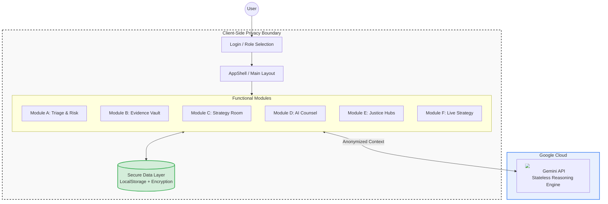

# JusticeAlly: The Universal Legal Navigator


**JusticeAlly** is an AI-powered legal navigation platform designed to bridge the "Access to Justice" gap. Acting as a **Senior Litigation Strategist** for Self-Represented Litigants and a **Force Multiplier** for Junior Attorneys, it combines ruthless legal strategy with compassionate administrative guidance powered by Google's Gemini AI.

> **🚀 Live Demo**: [https://justiceally-108816008638.us-west1.run.app](https://justiceally-108816008638.us-west1.run.app)
>
> **🎯 Current Status**: MVP demonstrating core AI capabilities | [View Full Architecture](./ARCHITECTURE.md) | [View Pitch Deck](./PITCH_DECK.md)

---

## 🏗️ System Architecture



---

## 💻 Installation & Setup

For a quick preview, visit the **[Live Demo](https://justiceally-108816008638.us-west1.run.app)**.

To run the project locally for development:

### Prerequisites

* **Node.js** (v18 or higher)
* **Google Gemini API Key** (Get one at [Google AI Studio](https://aistudio.google.com/))

### 1. Clone the Repository

```bash
git clone https://github.com/your-username/justice-ally.git
cd justice-ally
```

### 2. Install Dependencies

```bash
npm install
# or
yarn install
```

### 3. Environment Configuration

Create a `.env` file in the root directory. You **must** add your Gemini API key here. This file is git-ignored to protect your secrets.

```env
# .env
API_KEY=your_google_gemini_api_key_here
```

### 4. Run the Application

Start the development server.

```bash
npm run dev
```

Open [http://localhost:5173](http://localhost:5173) (or the port shown in your terminal) to view the app.

---

## 🚀 Deployment

### Vercel / Netlify

1. Fork this repository to your GitHub.
2. Import the project into Vercel or Netlify.
3. **Critical:** Add `API_KEY` to the **Environment Variables** in the deployment settings.
4. Deploy!

**Note:** Since this is a Vite app, the build command is `npm run build` and the output directory is `dist`.

---

## 🔧 Troubleshooting & Git Operations

### Unable to Push to GitHub?

If you encounter errors when pushing, check the following:

1. **Large Files**: Ensure you haven't accidentally committed large video or image files from your testing. The `.gitignore` is set up to exclude standard artifacts, but check your manual adds.
2. **Secrets in History**: If you accidentally committed your `.env` file, remove it immediately:

    ```bash
    git rm --cached .env
    echo ".env" >> .gitignore
    git commit -m "Remove secrets"
    ```

### API Errors (403/503)

* **403 Permission Denied**: Verify your API Key in `.env` is correct and has access to **Gemini 1.5 Pro/Flash** and **Gemini 3.0 Pro** models.
* **503 Unavailable**: The model might be overloaded. The app includes an exponential backoff retry mechanism, but you can also try again in a few seconds.

---

## 🌟 Application Capabilities

JusticeAlly provides a comprehensive suite of tools designed to empower users at every stage of the legal process.

### 🧠 Core Intelligence

* **Case Triage & Risk Matrix**: Intelligent intake system that evaluates case viability using a Red/Yellow/Green risk assessment model. It analyzes jurisdiction, claims, and available evidence to recommend whether a user should proceed Pro Se or seek counsel.
* **Bilingual Legal Brain**: The entire application toggles instantly between English and Spanish ("Justicia Aliada"), ensuring equal access to justice. The AI understands legal nuance in both languages.

### 🛡️ Evidence Management (Secure Vault)

* **Multi-Modal Ingestion**: Upload case files including PDFs, High-Res Images, and **Body Cam/CCTV Footage (MP4)**.
* **Smart Redaction Studio**: Integrated tool to manually or automatically redact Personally Identifiable Information (PII) before submission.
* **Evidence Relevance Engine**: AI-powered scoring system (1-10) that evaluates how strongly each piece of evidence supports individual legal elements (Duty, Breach, Causation, Damages).

### ⚔️ Litigation Strategy (The War Room)

* **Strategic Roadmap**: Generates a phase-by-phase litigation plan (Pre-filing -> Discovery -> Motion Practice -> Trial).
* **Black Letter Law Analysis**: Automatically maps user facts to specific legal elements required by state law.
* **"Sun Tzu" Competitive Analysis**: Predicts opposing counsel's likely moves and suggests counter-strategies.
* **Voice-to-Memo**: Dictate strategy notes directly into a structured legal memorandum format.

### 🤖 AI Counsel (Interactive Assistant)

* **Wargame Simulation**: Roleplay scenarios with the AI acting as an aggressive Opposing Counsel or a skeptical Judge to prepare for court.
* **Socratic Legal Guide**: Ask complex questions ("What is the statute of limitations for fraud in CA?") and receive cited, simplified answers.
* **Document Review**: Upload opposing motions for the AI to summarize and suggest potential grounds for objection.

### 🏛️ Justice Hubs (Specialized Workflows)

* **Housing / Eviction Defense**: Specialized flows for Unlawful Detainer responses and habitability claims.
* **Traffic & DUI**: Checklists for "Trial by Declaration" and analyzing police report errors.
* **Juvenile & Family**: Sensitive workflows for Emancipation, Dependency, and simple Divorce proceedings.

### 🎤 Live Strategy (Real-Time Voice)

* **Oral Argument Coach**: Practice your opening statement or motion arguments with a real-time voice-enabled AI feedback loop.
* **Hearing Prep**: Simulate the high-pressure environment of a courtroom hearing using low-latency voice interaction.

---

## 🗺️ Path Forward

### Development Roadmap

#### Phase 1: Production Infrastructure & Security (Weeks 1-4)

**Goal**: Transition from MVP to a robust, scalable backend capable of handling sensitive legal data.

* [ ] **High-Performance Backend**
  * **API Gateway**: Node.js/Express on Cloud Run for stateless, auto-scaling execution.
  * **Secure Authentication**: JWT-based session management with role-based access control (RBAC).
  * **Rate Limiting**: Redis-backed throttling to prevent abuse and manage API costs.
  
* [ ] **Database & Persistence**
  * **Cloud SQL (PostgreSQL)**: Relational storage for user profiles and structured case metadata.
  * **Encrypted Storage**: Cloud Storage buckets with customer-managed encryption keys for evidence files.
  
* [ ] **Security Hardening**
  * Server-side API key management (removing keys from client bundle).
  * End-to-End Encryption implementation.
  * Strict Content Security Policy (CSP) and CORS enforcement.

#### Phase 2: The Legal Forms Engine & Ecosystem (Months 2-3)

**Goal**: Democratize access to court documents and expand reach.

* [ ] **Verified Forms Repository**
  * **OCR & Ingestion**: Pipeline to ingest PDF forms from 50 state court websites.
  * **Smart Field Mapping**: AI-driven mapping of user facts to specific form fields (e.g., mapping "Plaintiff Name" to Form UD-100).
  * **Expert Verification Layer**: Community-driven verification system for form accuracy.

* [ ] **Browser Companion (Chrome Extension)**
  * **"Justice Anywhere"**: Analyze legal text on any webpage (e.g., rental contracts, Terms of Service).
  * **One-Click Triage**: Instant risk assessment from browser toolbar.

* [ ] **Enterprise Features**
  * Multi-tenancy for law firms and legal aid organizations.
  * Team collaboration and shared case workspaces.
  * Audit logs for compliance and accountability.

#### Phase 3: Global Expansion & The API Economy (Months 4-6)

**Goal**: Transcend borders and become the standard protocol for legal intelligence.

* [ ] **Mobile Justice (Android First)**
  * **Native Android App**: Targeting the widest global user base first.
  * **Offline Capability**: Evidence collection and voice notes without internet.

* [ ] **The "Justice Protocol" (MCP Server)**
  * **Model Context Protocol**: Expose JusticeAlly's "Black Letter Law" engine as an MCP server.
  * **Agent Interoperability**: Allow other AI agents (e.g., inside IDEs or productivity tools) to consult JusticeAlly for legal constraints.

* [ ] **International Justice Modules**
  * **Jurisdiction Agnostic Core**: Abstracting legal logic to support varied legal systems (Common Law vs. Civil Law).
  * **Localization Engine**: Expansion beyond Spanish to French, Portuguese, and Mandarin.

### Business Model

#### Revenue Streams

1. **Freemium Individual Users**
   * Free tier: Basic triage and AI counsel (5 questions/month)
   * Pro tier: $29/month - Unlimited AI, evidence vault, strategy tools
   * Premium tier: $79/month - Live voice strategy, priority support

2. **Law Firm Subscriptions**
   * Starter: $499/month (5 attorneys, unlimited cases)
   * Professional: $1,499/month (20 attorneys, team collaboration)
   * Enterprise: Custom pricing (unlimited users, white-label options)

3. **Legal Aid Organizations**
   * Non-profit pricing: 70% discount on all tiers
   * Grant-funded deployments
   * Training and implementation services

4. **API & Data Licensing**
   * Anonymous case outcome data for legal research
   * AI model training partnerships
   * Integration into LegalTech platforms

#### Market Opportunity

* **Total Addressable Market (TAM)**: $10B+ (US legal services market for individuals)
* **Serviceable Addressable Market (SAM)**: $2.5B (self-represented litigants + solo practitioners)
* **Serviceable Obtainable Market (SOM)**: $250M (target 10% in 5 years)

**Key Metrics:**

* 40M self-represented litigants in US annually
* 80% cannot afford legal representation
* Average legal issue costs $3K-$15K
* Our solution: $29-$79/month

### Go-to-Market Strategy

#### Year 1: Product-Market Fit

* Launch beta with 5 legal aid organizations

* Target 1,000 paid individual users
* Achieve $30K MRR (Monthly Recurring Revenue)
* Gather testimonials and case studies

#### Year 2: Growth

* Expand to 50 legal aid partnerships

* Acquire 10,000 paid individual users
* Sign 50 law firm accounts
* Achieve $500K MRR

#### Year 3: Scale

* National coverage across all 50 states

* 100,000+ active users
* 500+ law firm clients
* $5M ARR (Annual Recurring Revenue)

### Competitive Advantages

1. **AI-First Design**: Built on Gemini's multimodal AI from day one
2. **Privacy-First**: Data sovereignty and local-first architecture
3. **Bilingual**: Native Spanish support (40M+ US Spanish speakers)
4. **Voice Interface**: Only platform with real-time AI litigation strategy via voice
5. **Evidence AI**: Unique multimodal evidence analysis (documents, images, video)

### Team & Hiring Roadmap

**Current Team**: 2 founders (Product/Engineering)

**Phase 1 Hires** (Months 1-3):

* Senior Backend Engineer ($150K)
* DevOps Engineer ($140K)
* Legal Compliance Specialist ($120K)

**Phase 2 Hires** (Months 4-6):

* Product Manager ($160K)
* 2x AI Engineers ($180K each)
* Customer Success Lead ($110K)

**Phase 3 Hires** (Months 7-12):

* VP of Sales ($200K + equity)
* Marketing Manager ($130K)
* 2x Mobile Engineers ($160K each)
* Legal Content Creator ($100K)

### Funding Requirements

**Seed Round Target**: $1.5M

**Use of Funds:**

* Engineering & Product: 50% ($750K)
* Sales & Marketing: 25% ($375K)
* Legal & Compliance: 15% ($225K)
* Operations & Infrastructure: 10% ($150K)

**Expected Milestones:**

* Month 6: Production launch with 1,000 users
* Month 12: $50K MRR, SOC 2 certified
* Month 18: $200K MRR, Series A ready

**Series A (18-24 months)**: $8M-$12M for national expansion

### Risk Mitigation

| Risk | Mitigation Strategy |
|------|---------------------|
| **AI Accuracy** | Human-in-the-loop review, disclaimer enforcement, liability insurance |
| **Regulatory** | Legal advisory board, state-by-state compliance review |
| **Competition** | Strong IP protection, first-mover advantage, community building |
| **API Costs** | Caching layer, model optimization, tiered pricing to cover costs |
| **Data Security** | SOC 2 compliance, pen testing, bug bounty program |

### Next Steps for Investors

1. **Schedule Product Demo**: See JusticeAlly in action with real case scenarios
2. **Review Technical Diligence**: Access to [Architecture Documentation](./ARCHITECTURE.md)
3. **Pilot Program**: Partner with your portfolio companies' legal teams
4. **Advisory Interviews**: Speak with our legal and technical advisors

---

## 📊 Metrics & Analytics

**Current MVP Metrics**:

* 0 external dependencies (runs entirely client-side)
* <2s page load time
* <500ms AI response time
* 100% client-side privacy (no data sent to our servers)

**Target Production Metrics**:

* 99.9% uptime SLA
* <200ms API response time
* <3s AI analysis completion
* 100% data encryption at rest and in transit

---

## ⚠️ Disclaimer

**JusticeAlly is an automated educational tool.** It does not provide legal advice or create an attorney-client relationship. Users should always verify information with a qualified attorney or court clerk in their jurisdiction.
